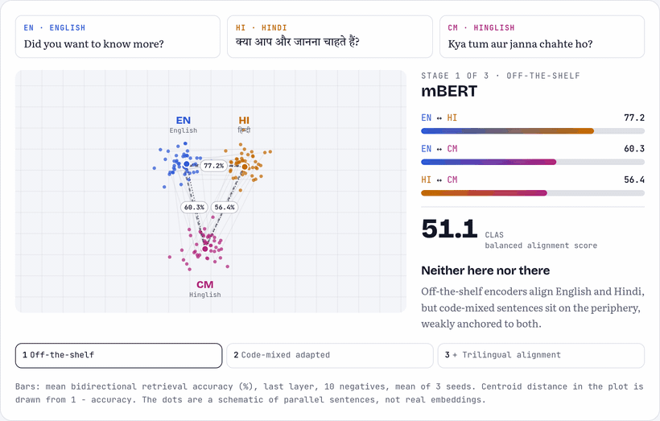

# Neither Here Nor There: Cross-Lingual Representation Dynamics of Code-Mixed Text in Multilingual Encoders

[](https://arxiv.org/abs/2603.19771)
[](https://arxiv.org/abs/2603.19771)
[](https://huggingface.co/datasets/debajyotimaz/trilingual-hinglish-corpus)
[](https://debajyotimaz.github.io/tri_align_EMNLP_2026/)

**Debajyoti Mazumder, Divyansh Pathak, Prashant Kodali, Jasabanta Patro** · EMNLP Findings 2026

**[Project page](https://debajyotimaz.github.io/tri_align_EMNLP_2026/)** · [Paper](https://arxiv.org/abs/2603.19771) · [Dataset](https://huggingface.co/datasets/debajyotimaz/trilingual-hinglish-corpus)

<p align="center"></p>

## TL;DR

- **Code-mixed text is peripheral.** mBERT and XLM-R align English and Hindi well, but code-mixed (CM) text is weakly anchored to both.
- **Adaptation trades one gap for another.** Hinglish pretraining improves EN↔CM alignment but hurts EN↔HI.
- **Trilingual alignment restores balance.** A cosine alignment loss over EN–HI, EN–CM and HI–CM pairs raises CLAS for every model (e.g. mBERT 14.20 → 50.97).

## Data

21,139 parallel English / Hindi (Devanagari) / Romanized Hinglish triples, built from CM-En Parallel, PHINC and LinCE (missing Hindi via Google Translate, checked with IndicTrans2).

```python
from datasets import load_dataset
ds = load_dataset("debajyotimaz/trilingual-hinglish-corpus")  # train 16,911 / test 4,228
```

A local copy is in `Data/Cleaned-Data/cleaned-trilingual-corpus/`.

## Setup

```bash
git clone https://github.com/debajyotimaz/tri_align_EMNLP_2026.git && cd tri_align_EMNLP_2026
pip install -r requirements.txt   # Python 3.9+
```

Scripts are standalone; edit the paths and model names at the top of each before running.

## Repository

| Folder | Contents |
|---|---|
| `Data/` | Trilingual corpus and downstream (hate, sentiment) data |
| `Interpretability/` | Retrieval, CKA/SVCCA, saliency, uncertainty, t-SNE, perplexity |
| `Post_alignment_training/` | Trilingual post-training for mBERT and XLM-R |
| `Downstream_tasks/` | Cross-lingual sentiment and hate speech evaluation |
| `Translation/` | Downstream data translation (Qwen2.5-72B-Instruct via vLLM) |

## Running

| Experiment | Command |
|---|---|
| Alignment probing (§4.1) | `python Interpretability/retrieval_scores/dot-product-retrieval-percentile.py` |
| CKA / SVCCA | `python Interpretability/similarity_scores/cka.py` · `svcca.py` |
| Token saliency | `python Interpretability/Token_level_saliency/Compute_RI.py` |
| Uncertainty | `python Interpretability/Uncertainty_scores/uncertainty_scores.py` |
| Trilingual post-training (§4.3) | `python Post_alignment_training/mbert-trilingual.py` · `xlmr-trilingual.py` |
| Downstream tasks | `python Downstream_tasks/cross_lingual_sentiment.py` · `cross_lingual_hate.py` |
| Translation (needs vLLM) | `cd Translation/trans_hate && bash trans.sh` |

## Results

CLAS (= MeanAcc − DirBias − SetupStd), last layer, 10 negatives, mean of 3 seeds.

| Model | Base | + Trilingual |
|---|---:|---:|
| mBERT | 14.20 | **50.97** |
| Hing-mBERT | 17.01 | **51.07** |
| Hing-mBERT-Mixed | 34.95 | **42.51** |
| XLM-R | 39.53 | **47.50** |
| Hing-RoBERTa | 3.74 | **58.98** |
| Hing-RoBERTa-Mixed | 73.09 | **73.50** |

## Citation

```bibtex
@article{mazumder2026neither,
  title   = {Neither Here Nor There: Cross-Lingual Representation Dynamics of Code-Mixed Text in Multilingual Encoders},
  author  = {Mazumder, Debajyoti and Pathak, Divyansh and Kodali, Prashant and Patro, Jasabanta},
  journal = {arXiv preprint arXiv:2603.19771},
  year    = {2026}
}
```

## License

The trilingual corpus (curation and Hindi translations) is released under [CC BY-NC-SA 4.0](https://creativecommons.org/licenses/by-nc-sa/4.0/) for research use. Source sentences remain under the terms of CM-En Parallel, PHINC and LinCE.
